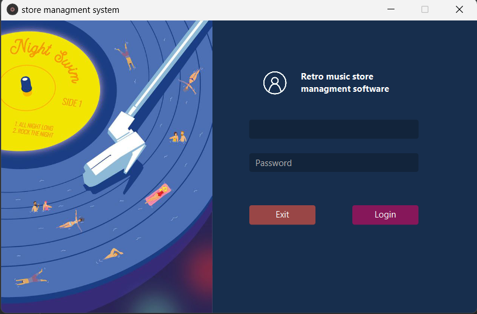
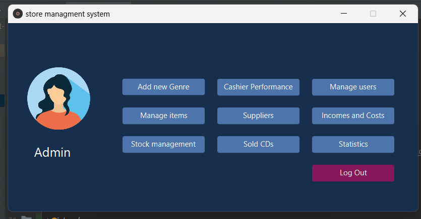
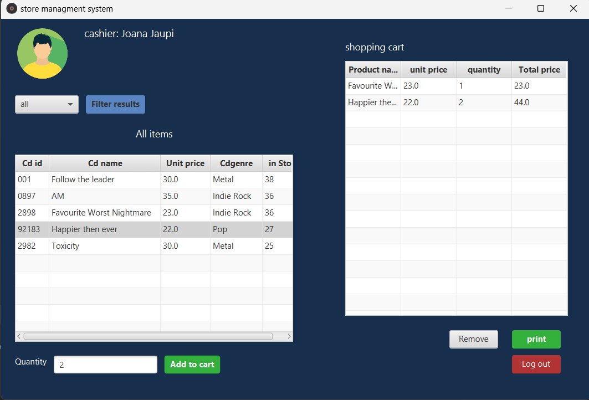
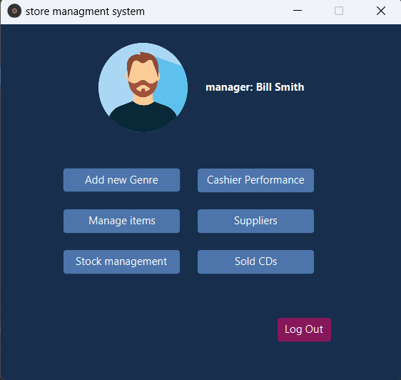
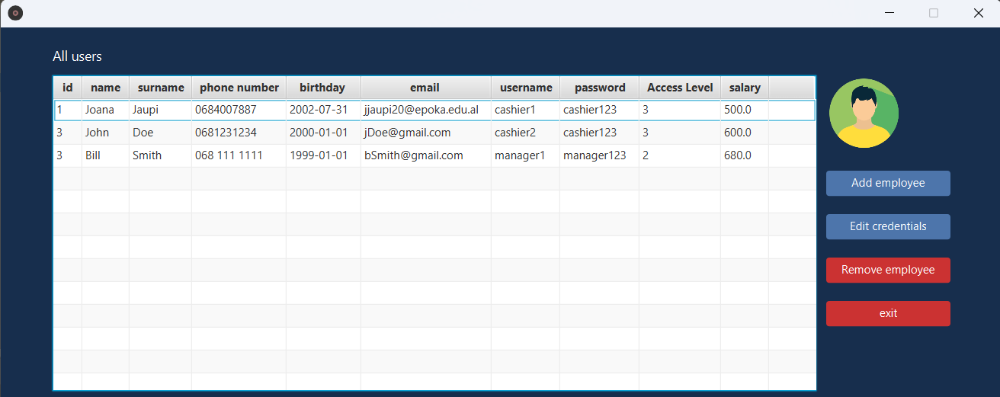
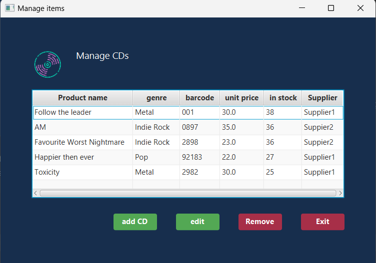
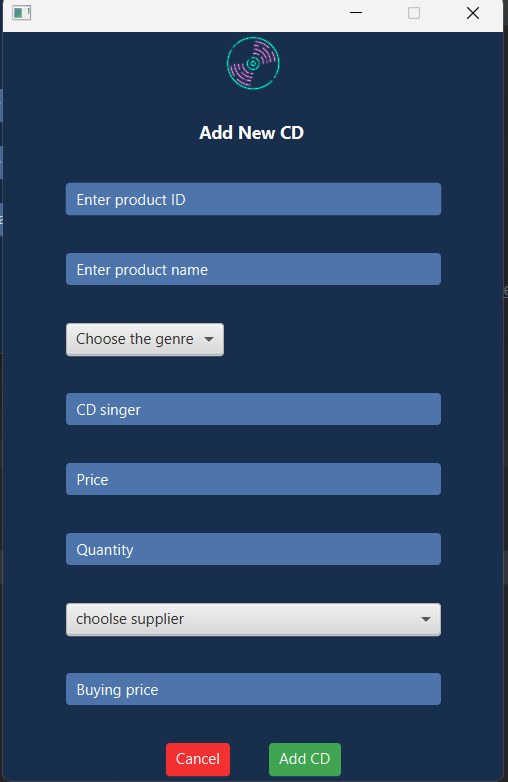
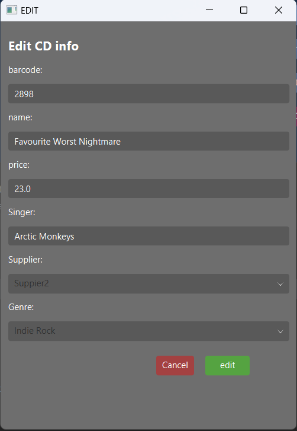
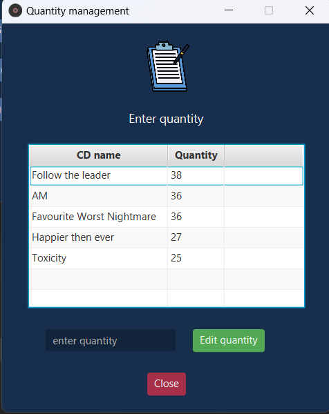

# Store Management System 

This project is a store management system designed for a CD store. It is developed as a project for CEN 215 - Object oriented programming course.
It allows three levels of access: cashier, manager, and admin. The system is implemented using object-oriented programming (OOP) principles with Java as the programming language, and the graphical user interface (GUI) is built using JavaFX.

### Features

- **Three levels of access**: The system has three levels of access, each with its own set of permissions. Cashiers can make purchases for clients, while managers can do everything that admins can do except manage people information.
- **Product management**: Admins and managers can add, edit, or remove products, as well as manage suppliers and quantities.
- **People management**: Admins can manage people information, including adding or removing cashiers, managers, and admins.
- **Statistics and reports**: Admins can view statistics on cashier performance, see the most sold products, check the history of sold CDs, and view incomes and costs.

### Requirements
1. Java JDK 
2. JavaFX (to download: https://gluonhq.com/products/javafx/)
3. Eclipse or Intellij IDEA

### Setup 
1. clone this repository to your local machine
2. load the project into your IDE (under ``/jjaupi20`` directory)
3. (in INTELLIJ) ``File >> Project Structure >> Libraries >> + >> Java >> locate where is the javafx-sdk/lib directory``
4. edit run configuration to add VM options ``Run >> Edit Configuration`` (under modify options >> add VM options >> add ``--module-path "\path\to\javafx-sdk-20\lib" --add-modules javafx.controls,javafx.fxml``

### Limitations

- The system currently does not support connecting to a database. Data is stored in files, which may not be as efficient or scalable as a database.

### Future Improvements

- Adding support for a database backend to improve data management and scalability.

## A look into the App

